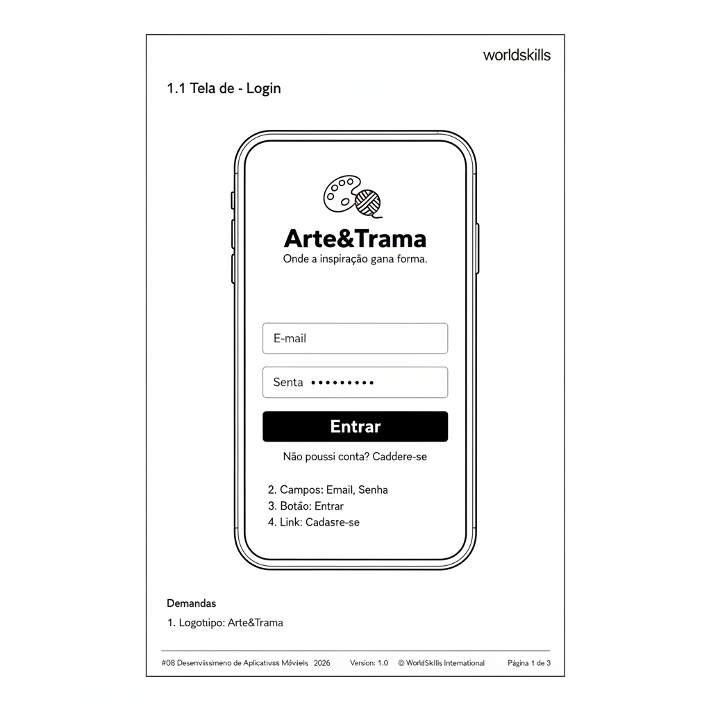
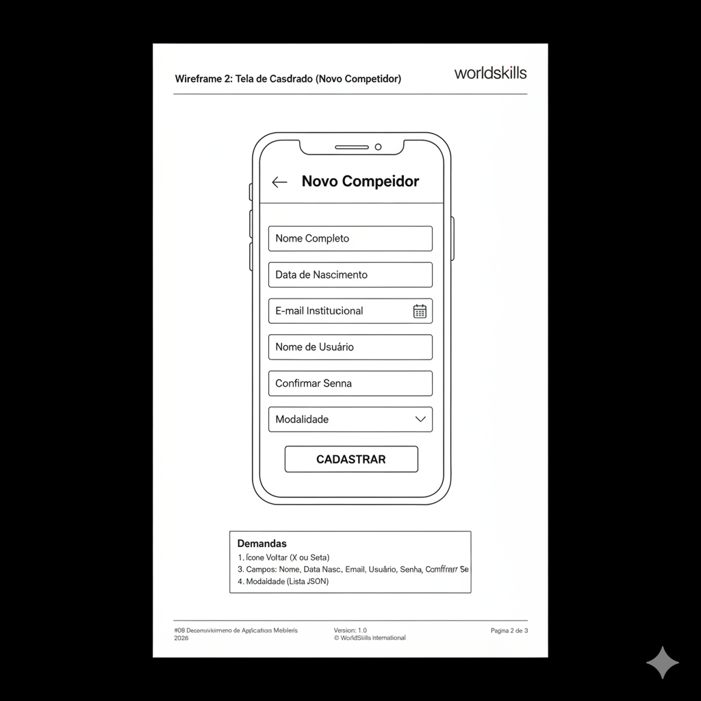
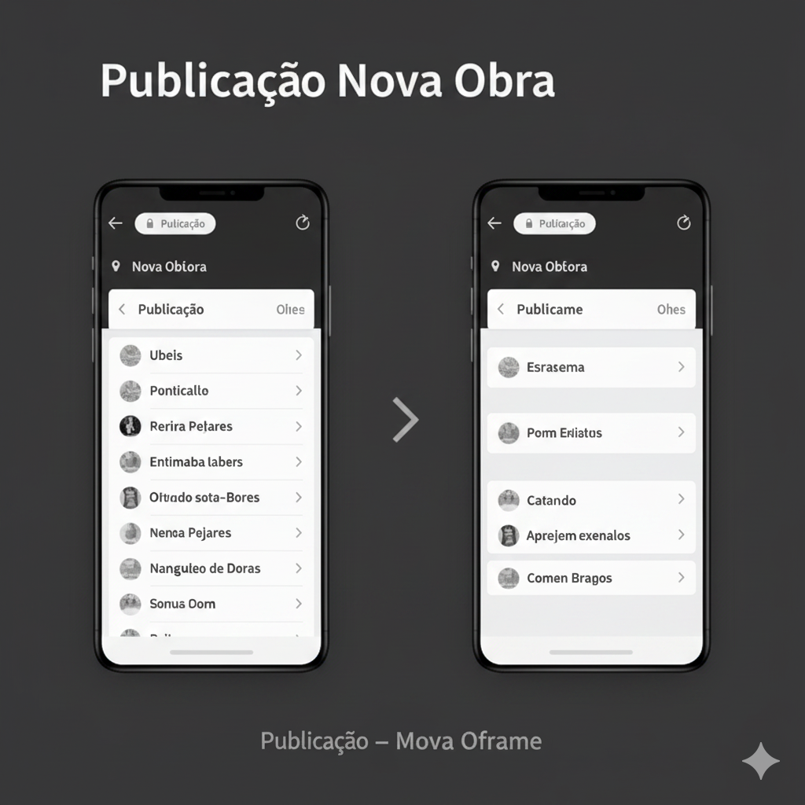

# **worldskills**

<br><br><br><br><br><br>

# Projeto Arte&Trama
## Desenvolvimento de Aplicativos Móveis
### Modulo D1 - Testes
### Dia 3 – P.M.

<br><br><br><br><br><br><br><br><br><br><br><br><br><br>

---
`#08 Desenvolvimento de Aplicativos Móveis` | `2026` | `Version: 1.0` | `© WorldSkills International` | `Página 2 de 10`
---

## **Conteúdo**
**Introdução** ................................................................................................................................................................. 3
**Descrição do Projeto e Tarefas** ............................................................................................................................. 3
**Demandas Gerais** ..................................................................................................................................................... 4
**Guia de Estilos** ......................................................................................................................................................... 5
**1 Desenvolvimento por Casos de Testes** ........................................................................................................... 6
**2 Testes Automatizados** ......................................................................................................................................... 8
**Instruções para o competidor** .............................................................................................................................. 10
**Esquema de Pontuação** ......................................................................................................................................... 10

---
`#08 Desenvolvimento de Aplicativos Móveis` | `2026` | `Version: 1.0` | `© WorldSkills International` | `Página 3 de 10`
---

## **Introdução**

**Arte&Trama** é uma rede social dedicada a conectar artesãos, artistas plásticos e amantes da arte com uma abordagem visual, interativa e inspiradora. Criada para valorizar o trabalho manual de forma inteligente e eficiente, Arte&Trama transforma o processo de divulgação e apreciação de obras em uma experiência envolvente e personalizada.

Através do aplicativo Arte&Trama, os criadores de conteúdo têm acesso a ferramentas de publicação de alta qualidade, apresentadas de forma dinâmica. Categorias de arte, descrições detalhadas, portfólios e interações fazem parte da jornada do usuário, tornando a descoberta de novos talentos mais leve e prazerosa. 

**Arte&Trama: Onde a inspiração ganha forma e se conecta ao mundo.**

O Product Manager forneceu a você os requisitos do produto para a versão mobile. Como desenvolvedor de aplicativos móveis, sua tarefa é desenvolver os aplicativos correspondentes com base nas descrições fornecidas, de acordo com as necessidades específicas de desenvolvimento e focar fortemente nos testes de interface e integração.

## **Descrição do Projeto e Tarefas**

O desenvolvedor não precisa se preocupar com a estética exata da interface do programa e a posição dos elementos além do que for exigido nas demandas. O trabalho pode divergir levemente de padrões de design genéricos, mas o desenvolvedor precisa considerar adequadamente a facilidade de uso. A tarefa de desenvolvimento é para dispositivos móveis (Smartphones).

| | Período | Nome | Tempo de Competição | Dispositivo |
| :--- | :--- | :--- | :--- | :--- |
| ✓ | P.M. | Testes (smartphone) | 3h | Emulator: Pixel 9 SDK 35 |

---
`#08 Desenvolvimento de Aplicativos Móveis` | `2026` | `Version: 1.0` | `© WorldSkills International` | `Página 4 de 10`
---

## **Demandas Gerais**

1. **Consistência nos Textos:** Certifique-se de que todos os textos dos componentes sejam exatamente iguais aos escritos neste Projeto Teste.
2. **Recursos Disponíveis:** Todos os dados, imagens e recursos necessários para a prova (como categorias de artesanato) podem ser encontrados na pasta `media-files`, inclusive as informações iniciais, que estarão disponíveis em um arquivo Json, `dados.json`.
3. **Desenvolvimento Baseado em Testes:** Crie o aplicativo com base em todos os casos de testes e, em seguida, desenvolva testes automatizados para cada uma das funções mostradas no plano de teste.
4. Ao entrar no aplicativo caso não tenha internet, a **Tela de Login** deve apresentar uma faixa vermelha com mensagem indicando uso do aplicativo em modo off-line e informando que a autenticação não poderá ser realizada. Essa faixa deve ser persistente até que a conexão com a internet seja restabelecida.
5. Caso o usuário já esteja logado no app e a internet cair, ele deverá receber uma mensagem indicando a falta de conectividade; se ele tentar realizar uma **Publicação**, a ação deve ser bloqueada com a mesma faixa vermelha.
6. Caso o usuário esteja utilizando o aplicativo em modo off-line e a internet volte, a tarja vermelha com a mensagem informando o modo off-line deve ser removida automaticamente.
7. Na **“Tela de Cadastro”**, deve haver bloqueio para que não seja possível o usuário realizar o *printscreen* (captura de tela). No caso de tentativa, o usuário deverá receber uma mensagem de aviso de segurança.
8. Todas as etapas dos **testes automatizados precisam ser mantidas por pelo menos 5 segundos** (Diferença entre um passo e outro) e as **mensagens de Feedback devem ser mantidas ao menos 5 segundos**;
9. **Guia de Estilo:** Siga as cores e tipografia base definidas conceitualmente para desenvolver o aplicativo e suas funcionalidades.

---
`#08 Desenvolvimento de Aplicativos Móveis` | `2026` | `Version: 1.0` | `© WorldSkills International` | `Página 5 de 10`
---

## **Guia de Estilos**

**LOGOTIPO**
*(Ícone de uma paleta de pintura com um novelo de lã)*
**Arte&Trama**
*Onde a inspiração ganha forma.*

**CORES**
* Fundo App: `#FAFAFA` (Branco Neve)
* Primária: `#D97736` (Terracota / Barro)
* Secundária: `#2C5E4E` (Verde Musgo)
* Texto Principal: `#1A1A1A`
* Alertas de Erro (Tarja/Toast): `#B3261E`

**TIPOGRAFIA**
* Montserrat Regular - 16px
* **Montserrat Bold - 20px**
* **Montserrat Black - 24px**

---
`#08 Desenvolvimento de Aplicativos Móveis` | `2026` | `Version: 1.0` | `© WorldSkills International` | `Página 6 de 10`
---

## **1 Desenvolvimento por Casos de Testes**

Desenvolva a aplicação entendendo os casos de testes:
Formulário 1.1: Aplicação UI de caso de Teste

| No. | Area | Demandas |
| :--- | :--- | :--- |
| 1 | **Tela – Login** | 1. O corpo da tela deve conter o Logotipo e o texto “Arte&Trama”.<br>2. Deve haver um formulário com os seguintes campos:<br> &nbsp;&nbsp;&nbsp;a) **E-mail:** Campo de texto com validação de formato `user@domain.com`;<br> &nbsp;&nbsp;&nbsp;b) **Senha:** Campo de texto oculto (password);<br>3. Botão principal com o texto **"Entrar"**;<br>4. Link clicável no rodapé com o texto: **"Não possui conta? Cadastre-se"** que deve redirecionar para a tela de Cadastro. |
| 2 | **Tela – Cadastro** | 1. O cabeçalho da tela deve conter:<br> &nbsp;&nbsp;&nbsp;a) Ícone Voltar (X ou Seta) – Se clicado deve redirecionar o usuário para a tela de Login;<br> &nbsp;&nbsp;&nbsp;b) Texto de título: **"Novo Artista"**;<br>2. No corpo da tela deve haver um formulário com os seguintes campos:<br> &nbsp;&nbsp;&nbsp;a) **Nome Completo:** Obrigatório, texto livre;<br> &nbsp;&nbsp;&nbsp;b) **E-mail:** Validação de formato;<br> &nbsp;&nbsp;&nbsp;c) **Senha:** Mínimo de 6 caracteres;<br> &nbsp;&nbsp;&nbsp;d) **Confirmar Senha:** Deve ser exatamente igual ao campo Senha;<br> &nbsp;&nbsp;&nbsp;e) **Tipo de Perfil:** Menu Dropdown contendo as opções ("Artesão", "Apreciador");<br>3. Botão principal com o texto **"Cadastrar"**;<br>4. Ao cadastrar com sucesso, exibir *Snackbar* de sucesso e retornar para a tela de Login. |
| 3 | **Tela – Publicação** | 1. O cabeçalho da tela deve conter:<br> &nbsp;&nbsp;&nbsp;a) Texto de título: **"Nova Publicação"**;<br> &nbsp;&nbsp;&nbsp;b) Botão "Cancelar" (ícone ou texto);<br>2. No corpo da tela deve haver:<br> &nbsp;&nbsp;&nbsp;a) **Área de Imagem:** Ao clicar nesta área, deve ser possível realizar a escolha de uma imagem na galeria do dispositivo. Após a escolha, uma miniatura deve ser exibida;<br> &nbsp;&nbsp;&nbsp;b) **Título:** Campo de texto com máximo de 50 caracteres;<br> &nbsp;&nbsp;&nbsp;c) **Categoria:** Menu Dropdown que deve consumir os dados do `dados.json` (Ex: Cerâmica, Pintura, Tecelagem);<br> &nbsp;&nbsp;&nbsp;d) **Descrição:** Caixa de texto de múltiplas linhas.<br>3. Botão **"Publicar"** no final da tela.<br>4. Se o botão "Cancelar" for clicado, exibir modal de confirmação: *"Deseja descartar esta publicação?"* com botões Sim e Não. |








---
`#08 Desenvolvimento de Aplicativos Móveis` | `2026` | `Version: 1.0` | `© WorldSkills International` | `Página 7 de 10`
---

## **2 Testes Automatizados**

Escreva os testes para funcionarem de forma automatizada, sem nenhuma interação manual de usuário;
Orientações para projetos Flutter:

**Configuração dos Pacotes:**

* Adicione as dependências necessárias no arquivo `pubspec.yaml`:
```yaml
dev_dependencies:
  flutter_test:
    sdk: flutter
  integration_test:
    sdk: flutter
```

**Estrutura do Diretório de Teste:**

* Crie um diretório `integration_test` na raiz do projeto.
* Crie os arquivos necessários para a implementação (ex: `app_test.dart`).

**Execute o teste:**

* Um exemplo seria: `flutter test --no-pub integration_test/app_test.dart`

---
`#08 Desenvolvimento de Aplicativos Móveis` | `2026` | `Version: 1.0` | `© WorldSkills International` | `Página 8 de 10`
---

## **Formulário 2.1: Funções da aplicação – Casos de Testes**
Tipo de teste: Teste E2E, caixa preta, automatizado

**Tela: Login**

| Passo | Descrição da ação | Dados de entrada | Resultados esperados |
| :--- | :--- | :--- | :--- |
| 1 | Inicialização do aplicativo | N/A | A aplicação inicia normalmente e exibe a tela de Login. |
| 2 | Tentar fazer login com E-mail vazio - Clique no botão "Entrar" | N/A | Mensagem de erro informando: “O e-mail é obrigatório”. |
| 3 | Tentar fazer login com formato de E-mail inválido | “artesao.arte.com” | Mensagem de erro informando: “Formato de e-mail inválido”. |
| 4 | Tentar fazer login com Senha vazia - Clique no botão "Entrar" | E-mail: "artesao@arte.com" | Mensagem de erro informando: “A senha é obrigatória”. |
| 5 | Tentar fazer login com credenciais incorretas | E-mail: "artesao@arte.com"<br>Senha: "senhaErrada" | Mensagem de erro: “Usuário ou senha incorretos”. |
| 6 | Fazer login com dados válidos | E-mail: "artesao@arte.com"<br>Senha: "senha123" | Usuário é autenticado e redirecionado para a tela de Feed (Página inicial do App). |
| 7 | Clicar no link "Não possui conta? Cadastre-se" | N/A | Redirecionamento para a tela de Cadastro. |

**Tela: Cadastro (Novo Artista)**

| Passo | Descrição da ação | Dados de entrada | Resultados esperados |
| :--- | :--- | :--- | :--- |
| 8 | Tentar salvar com Nome vazio - Clique no botão "Cadastrar" | N/A | Mensagem de erro: “O Nome Completo é obrigatório”. |
| 9 | Preencher Nome válido | "Maria das Artes" | O Nome "Maria das Artes" é exibido no campo. |
| 10 | Tentar salvar com Senha com menos de 6 caracteres | Senha: "12345" | Mensagem de erro: “A senha deve possuir no mínimo 6 caracteres”. |
| 11 | Tentar salvar com senhas divergentes | Senha: "senha123"<br>Confirmar: "senha321" | Mensagem de erro: “As senhas não coincidem”. |
| 12 | Clicar no campo "Tipo de Perfil" | Selecionar "Artesão" | A opção "Artesão" fica selecionada no Combo/Dropdown. |
| 13 | Clicar no botão "Cadastrar" com todos os dados válidos | Nome: "Maria das Artes"<br>E-mail: "maria@arte.com"<br>Senhas: "senha123"<br>Perfil: Artesão | Exibe a mensagem “Cadastro realizado com sucesso!” e usuário é redirecionado para a tela de Login. |
| 14 | Clicar no ícone de "Voltar" ou "X" no cabeçalho | N/A | Redirecionamento de volta para a tela de Login. |

---
`#08 Desenvolvimento de Aplicativos Móveis` | `2026` | `Version: 1.0` | `© WorldSkills International` | `Página 9 de 10`
---

**Tela: Publicação (Nova Obra)**

| Passo | Descrição da ação | Dados de entrada | Resultados esperados |
| :--- | :--- | :--- | :--- |
| 15 | Tentar publicar sem anexar uma foto da obra - Clique em "Publicar" | N/A | Mensagem de erro: “A imagem da obra é obrigatória”. |
| 16 | Adicionar imagem da galeria | Selecionar imagem ".jpg" | A miniatura da imagem da obra de arte é exibida na área de preview. |
| 17 | Tentar publicar com Título vazio | N/A | Mensagem de erro: “O título da publicação é obrigatório”. |
| 18 | Preencher Título com limite de caracteres excedido (Mais de 50) | "Vaso de Cerâmica Feito à Mão com Detalhes em Ouro Que Demorou Muito Tempo" | O campo bloqueia a digitação após o 50º caractere ou exibe erro de limite atingido. |
| 19 | Selecionar Categoria da Obra no menu Dropdown | Selecionar "Cerâmica" | A categoria "Cerâmica" (vinda do JSON) fica selecionada no Combo. |
| 20 | Preencher Descrição da obra | "Vaso exclusivo, modelado à mão." | O texto é exibido corretamente na caixa de texto de múltiplas linhas. |
| 21 | Clicar no botão "Publicar" com todos os dados válidos | Imagem: [Anexada]<br>Título: "Vaso Rústico"<br>Categoria: "Cerâmica"<br>Desc: [Preenchida] | Obra é salva, é exibida a mensagem “Obra publicada com sucesso!” e o usuário é redirecionado para a tela inicial. |
| 22 | Clicar no botão "Cancelar" no cabeçalho/rodapé da tela | N/A | Um modal de aviso "Deseja descartar esta publicação?" é exibido na tela. |

---
`#08 Desenvolvimento de Aplicativos Móveis` | `2026` | `Version: 1.0` | `© WorldSkills International` | `Página 10 de 10`
---

## **Instruções para o competidor**

1. Você deve salvar os arquivos do projeto em uma pasta com o nome: `08_Modulo_D1_XX`, onde `XX` corresponde ao número de sua estação de trabalho.
2. Você deve renomear o APK como `08_Modulo_D1_XX.apk` e salvar na raiz da pasta `08_Modulo_D1_XX`.
3. Todo conteúdo de `08_Modulo_D1_XX` deverá ser enviado para o repositório remoto no servidor GIT, com esta mesma nomenclatura.
4. Serão aceitos somente os trabalhos publicados no repositório remoto até o fim do tempo limite da prova.

## **Esquema de Pontuação**

**Module D1 - Testes**

| No. | Subcritério | Pontos |
| :---: | :--- | :---: |
| 1 | Demandas gerais (Modo offline, Json, Proteção Printscreen) | 2,00 |
| 2 | Interface da Tela de Login | 1,25 |
| 3 | Interface da Tela de Cadastro | 1,75 |
| 4 | Interface da Tela de Publicação | 2,00 |
| 5 | Testes Automatizados - Login (Passos 1 ao 7) | 4,00 |
| 6 | Testes Automatizados - Cadastro (Passos 8 ao 14) | 4,00 |
| 7 | Testes Automatizados - Publicação (Passos 15 ao 22) | 3,00 |
| 8 | Testes Automatizados – Atendimento ao tempo de espera (5 seg) | 1,00 |
| 9 | Julgamentos e boas práticas do código | 1,00 |
| | **Total** | **20,00** |