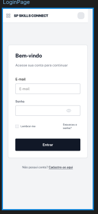
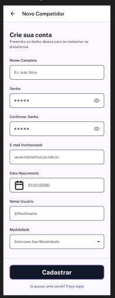
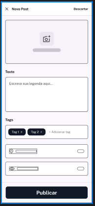
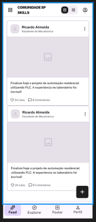

# **WorldSkills**

<br><br><br><br><br><br>

# Projeto SP Skills Connect
## Desenvolvimento de Aplicativos Móveis
### Modulo D1 - Testes
### Dia 3 – P.M.

<br><br><br><br><br><br><br><br><br><br><br><br><br><br>

---
`#08 Desenvolvimento de Aplicativos Móveis` | `2026` | `Version: 1.0` | `© WorldSkills International` | `Página 1 de 10`
---

## **Conteúdo**
| Seção | Página |
| :--- | ---: |
| Introdução | 3 |
| Descrição do Projeto e Tarefas | 3 |
| Demandas Gerais | 4 |
| Guia de Estilos | 5 |
| 1 Desenvolvimento de Interface (UI) | 6 |
| 2 Testes Automatizados (E2E) | 7 |
| 3 Testes Manuais de Usabilidade (Avaliador) | 8 |
| Instruções para o competidor | 9 |
| Esquema de Pontuação | 10 |

---
`#08 Desenvolvimento de Aplicativos Móveis` | `2026` | `Version: 1.0` | `© WorldSkills International` | `Página 2 de 10`
---

## **Introdução**

**SP Skills Connect** é a rede social oficial focada na comunidade de competidores da São Paulo Skills. A plataforma foi criada para conectar os alunos de forma inteligente e eficiente, transformando o processo de preparação em uma experiência colaborativa, motivadora e engajadora. 

Através do aplicativo, os estudantes que irão participar da competição podem interagir, compartilhar dicas, acompanhar o progresso de seus estudos, postar fotos de seus treinamentos nas oficinas e discutir novidades sobre suas modalidades. A plataforma visa construir um ambiente de apoio mútuo, fortalecendo a rede de contatos e a união entre os futuros campeões.

**SP Skills Connect: Conectando talentos, forjando campeões.**

O Product Manager forneceu a você os requisitos de negócio e os fluxos das funcionalidades para a versão mobile. Como desenvolvedor de aplicativos móveis, sua tarefa é desenvolver as interfaces solicitadas e garantir sua funcionalidade através da implementação rigorosa de testes automatizados E2E (ponta a ponta), além de garantir que a aplicação passe por criteriosos testes manuais de usabilidade.

## **Descrição do Projeto e Tarefas**

O desenvolvedor não precisa se preocupar com a estética exata da interface do programa e a posição dos elementos além do que for exigido nas demandas e no guia de estilos. O trabalho pode apresentar decisões próprias de layout, mas o desenvolvedor precisa considerar adequadamente a usabilidade, a navegação fluida e a experiência do competidor. 

O escopo desta prova foca na criação de quatro telas principais: **Login**, **Cadastro**, **Feed de Publicações** e **Nova Publicação**, englobando automação de testes de regressão e suporte à validação manual.

| | Período | Nome | Tempo de Competição | Dispositivo |
| :--- | :--- | :--- | :--- | :--- |
| ✓ | P.M. | Testes (smartphone) | 3h | Emulator: Pixel 9 SDK 35 |

---
`#08 Desenvolvimento de Aplicativos Móveis` | `2026` | `Version: 1.0 | `© WorldSkills International` | `Página 3 de 10`
---

## **Demandas Gerais**

1. **Consistência nos Textos:** Certifique-se de que todos os textos dos componentes e mensagens de erro/validação sejam exatamente iguais aos escritos neste Projeto Teste.
2. **Recursos Disponíveis:** Todos os dados, imagens e recursos necessários para a prova (como a lista de modalidades e os posts iniciais do feed) podem ser encontrados na pasta `media-files`. As informações essenciais da aplicação estarão disponíveis em um arquivo JSON local, o `dados.json`.
3. **Desenvolvimento Baseado em Testes:** Crie o aplicativo com base em todos os casos de testes descritos e, em seguida, desenvolva testes automatizados para cada uma das ações mostradas no plano de testes automatizados.
4. Ao entrar no aplicativo, caso não tenha internet, a **Tela de Login** deve apresentar uma faixa vermelha com mensagem indicando uso do aplicativo em modo off-line e informando que a autenticação não poderá ser realizada. Essa faixa deve ser persistente até que a conexão com a internet seja restabelecida.
5. Caso o usuário já esteja logado no app e a internet cair, independentemente da tela em que ele esteja, ele deverá receber uma mensagem (Snackbar) indicando a falta de conectividade. Caso ele tente criar um **Novo Post (Publicação)**, a ação deve ser bloqueada.
6. Caso o usuário esteja utilizando o aplicativo em modo off-line e a internet volte, a tarja vermelha ou aviso de off-line deve ser removida automaticamente.
7. Na **“Tela Cadastro de Competidor”**, deve haver bloqueio de segurança para que não seja possível o usuário realizar o *printscreen* (captura de tela). No caso de tentativa, o usuário deverá receber uma mensagem de aviso do sistema operacional ou do app.
8. Todas as etapas dos **testes automatizados precisam ser mantidas por pelo menos 5 segundos** (diferença de tempo visível entre um passo e outro para avaliação) e as **mensagens de Feedback (Toasts/Snackbars) devem ser mantidas ao menos por 5 segundos**;
9. **Guia de Estilo:** Siga as cores e a tipografia base definidas no Guia de Estilos para desenvolver o aplicativo.

---
`#08 Desenvolvimento de Aplicativos Móveis` | `2026` | `Version: 1.0` | `© WorldSkills International` | `Página 4 de 10`
---

## **Guia de Estilos**

**LOGOTIPO**
*(Ícone de engrenagens interligadas com um balão de fala)*
**SP Skills Connect**
*Conectando talentos.*

**CORES**
* Fundo App: `#F4F6F8` (Cinza Claro)
* Primária: `#0033A0` (Azul Institucional)
* Secundária: `#E20031` (Vermelho Destaque)
* Texto Principal: `#1E1E1E` (Cinza Escuro)
* Alertas de Erro (Tarja/Toast): `#B3261E`

**TIPOGRAFIA**
* Roboto Regular - 16px
* **Roboto Medium - 20px**
* **Roboto Bold - 24px**

---
`#08 Desenvolvimento de Aplicativos Móveis` | `2026` | `Version: 1.0` | `© WorldSkills International` | `Página 5 de 10`
---

## **1 Desenvolvimento de Interface (UI)**

Desenvolva a aplicação atendendo aos requisitos de interface para suportar tanto os testes automatizados quanto a avaliação manual de navegação:

| No. | Area | Demandas |
| :--- | :--- | :--- |
| 1 | **Tela – Login** | 1. O cabeçalho/topo da tela deve exibir o Logotipo e o título “SP Skills Connect”.<br>2. Deve haver um formulário central contendo:<br> &nbsp;&nbsp;&nbsp;a) **E-mail:** Campo de texto exigindo o padrão institucional (`@spskills.com.br`);<br> &nbsp;&nbsp;&nbsp;b) **Senha:** Campo de texto com ofuscação (password), **contendo obrigatoriamente um ícone de "olho" para ocultar/desocultar a senha** digitada;<br>3. Botão de ação primária com o texto **"Entrar"**;<br>4. Texto clicável no rodapé: **"Não possui conta? Cadastre-se aqui"** que redireciona para a tela de Cadastro. |
| 2 | **Tela – Cadastro** | 1. O cabeçalho da tela deve conter ícone Voltar e o título: **"Novo Competidor"**;<br>2. O formulário deve conter os seguintes campos:<br> &nbsp;&nbsp;&nbsp;a) **Nome Completo:** Texto livre;<br> &nbsp;&nbsp;&nbsp;b) **Data de Nascimento:** Campo que abra um **calendário nativo** (DatePicker);<br> &nbsp;&nbsp;&nbsp;c) **E-mail Institucional:** Validação de formato;<br> &nbsp;&nbsp;&nbsp;d) **Nome de Usuário:** Campo único;<br> &nbsp;&nbsp;&nbsp;e) **Senha e Confirmar Senha:** Ambos devem ter o **ícone de "olho" para alternar a visibilidade**;<br> &nbsp;&nbsp;&nbsp;f) **Modalidade (Consumo JSON):** Campo que abra um componente de Dropdown nativo ou Modal listando as modalidades lidas do `dados.json`.<br>3. Botão principal **"Cadastrar"**. A tela deve permitir rolagem (Scroll) caso o teclado virtual sobreponha os campos. |
| 3 | **Tela – Feed de Publicações** | 1. O cabeçalho da tela deve exibir o título "Comunidade SP Skills";<br>2. No cabeçalho (lado direito), deve haver **dois ícones de alternância (Toggle) para layout: um ícone de "Grid" e um ícone de "Lista"**.<br>3. O corpo da tela deve renderizar as publicações (consumidas do `dados.json` + as novas criadas na sessão).<br> &nbsp;&nbsp;&nbsp;a) **Se "Lista" estiver ativo:** Os posts devem aparecer um embaixo do outro, exibindo Nome do Usuário, Imagem ocupando a largura da tela, e o Texto/Tags abaixo da imagem.<br> &nbsp;&nbsp;&nbsp;b) **Se "Grid" estiver ativo:** A tela deve exibir uma grade (2 colunas), mostrando apenas a Imagem (em miniatura quadrada) e o Nome do Usuário sobreposto ou logo abaixo.<br>4. Deve haver um **Float Action Button (FAB) com o ícone de "+"** no canto inferior direito para redirecionar à tela de Nova Publicação. |
| 4 | **Tela – Publicação** | 1. O cabeçalho da tela deve conter:<br> &nbsp;&nbsp;&nbsp;a) Título: **"Novo Post"**;<br> &nbsp;&nbsp;&nbsp;b) Ícone de Lixeira ou texto "Descartar";<br>2. No corpo da tela deve haver:<br> &nbsp;&nbsp;&nbsp;a) **Área de Imagem:** Permitir seleção da galeria. Exibir miniatura após seleção;<br> &nbsp;&nbsp;&nbsp;b) **Texto:** Caixa de múltiplas linhas (textarea), limite de 300 caracteres;<br> &nbsp;&nbsp;&nbsp;c) **Tags:** Campo para adicionar hashtags;<br>3. Botão **"Publicar"** no rodapé. |

---
### WireFrames





---
`#08 Desenvolvimento de Aplicativos Móveis` | `2026` | `Version: 1.0` | `© WorldSkills International` | `Página 6 de 10`
---

## **2 Testes Automatizados**

Escreva os testes para funcionarem de forma automatizada (E2E), sem nenhuma interação manual de usuário durante a execução da suíte.

**Orientações para projetos Flutter:**

* Adicione as dependências necessárias no arquivo `pubspec.yaml`:
```yaml
dev_dependencies:
  flutter_test:
    sdk: flutter
  integration_test:
    sdk: flutter
```

**Estrutura do Diretório de Teste:**

* Crie um diretório `integration_test` na raiz do projeto.
* Crie os arquivos necessários para a implementação (Ex: `app_test.dart`).

**Execute o teste:**

* Utilize o comando nativo: `flutter test --no-pub integration_test/app_test.dart`

---
`#08 Desenvolvimento de Aplicativos Móveis` | `2026` | `Version: 1.0` | `© WorldSkills International` | `Página 7 de 10`
---

## **Formulário 2.1: Funções da aplicação – Casos de Testes**
**Tipo de teste:** Teste E2E, caixa preta, automatizado

**Tela: Login**
| Passo | Descrição da ação | Dados de entrada | Resultados esperados |
| :--- | :--- | :--- | :--- |
| 1 | Inicialização do aplicativo | N/A | A aplicação inicia normalmente e exibe a tela de Login. |
| 2 | Tentar fazer login com E-mail vazio - Clique no botão "Entrar" | N/A | Mensagem de erro: “O e-mail da São Paulo Skills é obrigatório”. |
| 3 | Tentar fazer login com formato de E-mail inválido (sem o domínio correto) | "aluno@email.com" | Mensagem de erro: “Utilize seu e-mail institucional @spskills.com.br”. |
| 4 | Tentar fazer login com Senha vazia - Clique no botão "Entrar" | E-mail: "aluno@spskills.com.br" | Mensagem de erro: “A senha é obrigatória”. |
| 5 | Tentar fazer login com credenciais incorretas | E-mail: "aluno@spskills.com.br"<br>Senha: "senhaErrada" | Mensagem de erro: “Credenciais inválidas. Verifique seu e-mail e senha.”. |
| 6 | Fazer login com dados válidos | E-mail: "competidor.exemplo@spskills.com.br"<br>Senha: "MinhaSenhaForte123" | Usuário é autenticado e redirecionado para a tela de Feed (Página inicial do App). |
| 7 | Clicar no link "Não possui conta? Cadastre-se aqui" | N/A | Redirecionamento correto para a tela de Cadastro. |

**Tela: Cadastro (Novo Competidor)**
| Passo | Descrição da ação | Dados de entrada | Resultados esperados |
| :--- | :--- | :--- | :--- |
| 8 | Tentar salvar com Nome de Usuário vazio - Clique no botão "Cadastrar" | N/A | Mensagem de erro: “O Nome de Usuário é obrigatório”. |
| 9 | Preencher Nome de Usuário válido | "JoaoSkillsDev" | O Nome de Usuário "JoaoSkillsDev" é exibido no campo. |
| 10 | Tentar salvar com Senha inferior a 8 caracteres | Senha: "skills1" | Mensagem de erro: “A senha deve possuir no mínimo 8 caracteres”. |
| 11 | Tentar salvar com senhas divergentes | Senha: "SPskills2026"<br>Confirmar: "Skills2026SP" | Mensagem de erro: “As senhas não coincidem”. |
| 12 | Selecionar Data de Nascimento menor que 15 anos | Calendário: Data que resulte em 14 anos | Mensagem de erro: “O competidor deve ter entre 15 e 21 anos completos”. |
| 13 | Selecionar Data de Nascimento maior que 21 anos | Calendário: Data que resulte em 22 anos | Mensagem de erro: “O competidor deve ter entre 15 e 21 anos completos”. |
| 14 | Selecionar Data de Nascimento válida (entre 15 e 21 anos) | Calendário: Data que resulte em 18 anos | A data selecionada é exibida corretamente no campo e sem mensagens de erro. |
| 15 | Clicar no campo "Modalidade" para abrir a lista de seleção | N/A | Uma lista ou modal é exibida na tela contendo as modalidades carregadas dinamicamente do arquivo `dados.json`. |
| 16 | Selecionar uma ocupação da lista gerada pelo JSON | Selecionar "Desenvolvimento de Software" | A lista fecha e a opção "Desenvolvimento de Software" fica preenchida/selecionada no campo Modalidade. |
| 17 | Clicar no botão "Cadastrar" com todos os dados preenchidos corretamente | Nome: "João Silva"<br>Data Nasc.: [Válida]<br>E-mail: "joao.silva@spskills.com.br"<br>Usuário: "JoaoSkillsDev"<br>Senhas: "SPskills2026"<br>Mod.: "Dev. Software" | Cadastro é processado, exibe a mensagem “Cadastro realizado com sucesso! Faça seu login.” e retorna para a tela de Login. |
| 18 | Clicar no ícone de "Voltar" ou "X" no cabeçalho | N/A | Redirecionamento de volta para a tela de Login sem salvar dados residuais. |


**Tela: Feed de Publicações**
| Passo | Descrição da ação | Dados de entrada | Resultados esperados |
| :--- | :--- | :--- | :--- |
| 19 | Efetuar login novamente (Pós-cadastro) | E-mail: "joao@spskills.com.br"<br>Senha: "SPskills2026" | Acesso concedido, tela Feed é carregada consumindo dados base do JSON. |
| 20 | Clicar no botão/ícone de formato "Grid" | N/A | O layout da listagem de publicações muda visualmente para o formato grade (colunas). |
| 21 | Clicar no botão/ícone de formato "Lista" | N/A | O layout retorna ao formato de lista linear (vertical). |
| 22 | Clicar no Float Action Button (+) | N/A | Usuário é redirecionado para a tela de Nova Publicação. |

**Tela: Publicação (Novo Post)**
| Passo | Descrição da ação | Dados de entrada | Resultados esperados |
| :--- | :--- | :--- | :--- |
| 23 | Tentar publicar sem Texto ou Imagem - Clique em "Publicar" | N/A | Mensagem de erro: “Sua publicação não pode estar vazia. Adicione texto ou imagem.”. |
| 24 | Adicionar imagem da galeria | Selecionar imagem ".jpg" | A miniatura da imagem é exibida na área de preview de anexo. |
| 25 | Preencher Texto da Publicação | "Preparando para a São Paulo Skills! #DevSkills #Foco" | O texto é exibido corretamente na caixa de texto. |
| 26 | Tentar publicar com texto ultrapassando o limite (Mais de 300 caracteres) | Texto de 350 caracteres | O campo bloqueia a digitação do excedente ou o sistema exibe erro: "Limite de caracteres excedido (300)". |
| 27 | Adicionar uma "Tag" à publicação | Digitar "Desenvolvimento" e aplicar | A tag "Desenvolvimento" é exibida como um *chip* ou texto destacado abaixo do campo principal. |
| 28 | Clicar no botão "Publicar" com informações válidas | Texto: "Dia de muito estudo para a competição!"<br>Tags: "#Backend" | Publicação é enviada, exibe a mensagem “Publicação enviada com sucesso!” e o usuário é redirecionado para o Feed. |
| 29 | Clicar no botão "Descartar" (ou lixeira) no topo da tela | N/A | Um modal de aviso "Deseja descartar este post?" é exibido para confirmação do usuário. |

--
`#08 Desenvolvimento de Aplicativos Móveis` | `2026` | `Version: 1.0` | `© WorldSkills International` | `Página 8 de 10`
---

**Formulário 3.1: Casos de Testes Manuais a serem aplicados pelos Avaliadores**

| Tela | O que o Avaliador fará no dispositivo (Ação Manual) | Comportamento Esperado (Critério de Aceite) |
| :--- | :--- | :--- |
| **Login** | 1. Digitar uma senha no campo e clicar no **ícone de Olho**.<br>2. Clicar novamente no ícone.<br>3. Tocar fora do teclado (no fundo da tela). | 1. A senha digitada deve se tornar visível (desocultar).<br>2. A senha deve voltar a ficar oculta (••••).<br>3. O teclado virtual do aparelho deve fechar (dismiss). |
| **Cadastro** | 1. Abrir o seletor de **Data de Nascimento**.<br>2. Tocar no campo de **E-mail Institucional** para abrir o teclado virtual.<br>3. Digitar a senha e usar o **ícone de Olho** em ambos os campos de senha.<br>4. Abrir o menu **Modalidade (Dropdown/Modal)** e fazer scroll.<br>5. Abrir o teclado no último campo da tela. | 1. Um DatePicker amigável (nativo) deve ser exibido na tela, permitindo troca de anos de forma fácil.<br>2. O teclado acionado deve ser do **tipo específico para E-mail** (apresentando o caractere '@' de forma facilitada na tela principal do teclado).<br>3. A visibilidade deve funcionar de forma independente ou sincronizada em ambos os campos.<br>4. A lista deve fluir corretamente na rolagem, sem cortar o último item da lista do JSON.<br>5. A tela inteira deve fazer "scroll up" (rolar) para que o botão "Cadastrar" não fique inacessível sob o teclado. |
| **Feed** | 1. Fazer **Scroll up/down** (rolagem rápida) na lista de publicações.<br>2. Tocar seguidamente (várias vezes) nos botões de layout **Grid e Lista** do cabeçalho. | 1. A rolagem deve ser suave, sem travamentos (*lags*), e as imagens carregadas do JSON não devem se distorcer ou esticar quebrando o *aspect-ratio*.<br>2. A transição visual da tela deve ocorrer corretamente entre 1 coluna completa (Lista) e 2 colunas miniaturas (Grid), sem duplicar dados ou corromper a UI. |
| **Publicação** | 1. Tocar na caixa de **Texto da Publicação** e digitar várias linhas.<br>2. Tocar no ícone Lixeira e depois **tocar na área escura (fundo/backdrop)** do modal de confirmação. | 1. O `textarea` deve permitir rolagem interna ou expandir até um limite razoável sem empurrar o botão "Publicar" para fora da tela de forma irrecuperável.<br>2. Ao tocar fora da caixa de diálogo (modal) de descarte, o modal deve fechar e a publicação não deve ser descartada (comportamento padrão de dismissible dialogs). |

---
`#08 Desenvolvimento de Aplicativos Móveis` | `2026` | `Version: 1.0` | `© WorldSkills International` | `Página 9 de 10`
---

## **Instruções para o competidor**

1. Você deve salvar os arquivos do projeto em uma pasta com o nome: `08_Modulo_D1_XX`, onde `XX` corresponde ao número de sua estação de trabalho.
2. Você deve renomear o APK compilado como `08_Modulo_D1_XX.apk` e salvar na raiz da pasta `08_Modulo_D1_XX`.
3. Todo o conteúdo da pasta `08_Modulo_D1_XX` deverá ser enviado para o repositório remoto no servidor GIT, obrigatoriamente com esta mesma nomenclatura de commits e branchs indicados pelos avaliadores.
4. Serão aceitos somente os trabalhos publicados e *pushados* no repositório remoto até o momento do esgotamento do tempo limite.

## **Esquema de Pontuação**

**Module D1 - Testes (Total 20,00 Pontos)**

| No. | Subcritério | Pontos |
| :---: | :--- | :---: |
| 1 | Demandas gerais (Modo offline, JSON, Proteção Printscreen) | 1,50 |
| 2 | UI: Tela de Login | 1,00 |
| 3 | UI: Tela de Cadastro (Data, Consumo JSON e Scroll) | 1,50 |
| 4 | UI: Tela de Feed de Publicações (Grid e Lista, FAB) | 1,50 |
| 5 | UI: Tela de Nova Publicação | 1,50 |
| 6 | Automação (E2E) - Login (Passos 1 ao 6) | 2,00 |
| 7 | Automação (E2E) - Cadastro (Passos 7 ao 12) | 2,50 |
| 8 | Automação (E2E) - Feed (Passos 13 ao 16) | 1,50 |
| 9 | Automação (E2E) - Publicação (Passos 17 ao 21) | 2,00 |
| 10 | **Testes Manuais de Usabilidade** (Avaliador executa Tabela 3.1) | 4,00 |
| 11 | Automação atendendo ao tempo de espera (5 seg) e Boas Práticas | 1,00 |
| | **Total** | **20,00** |

---
`#08 Desenvolvimento de Aplicativos Móveis` | `2026` | `Version: 1.0` | `© WorldSkills International` | `Página 10 de 10`
---